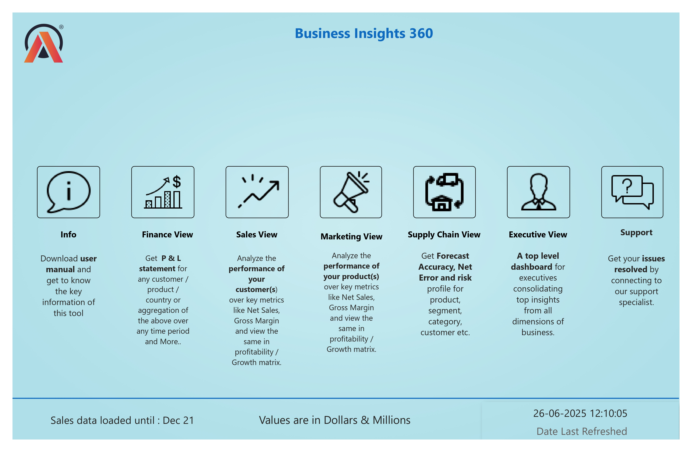
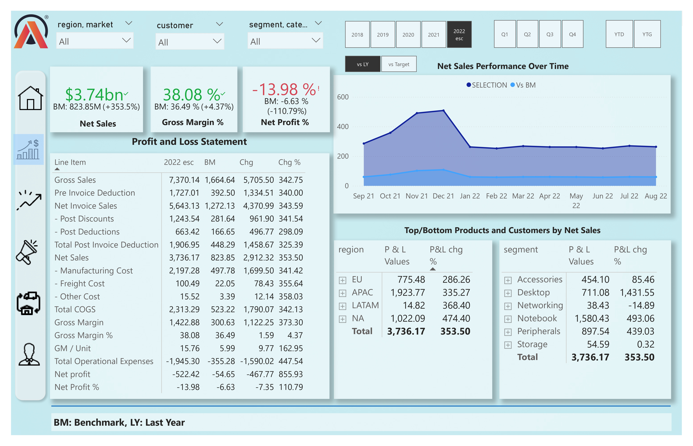
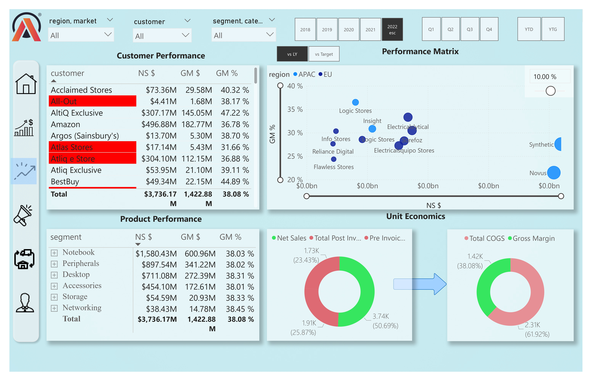
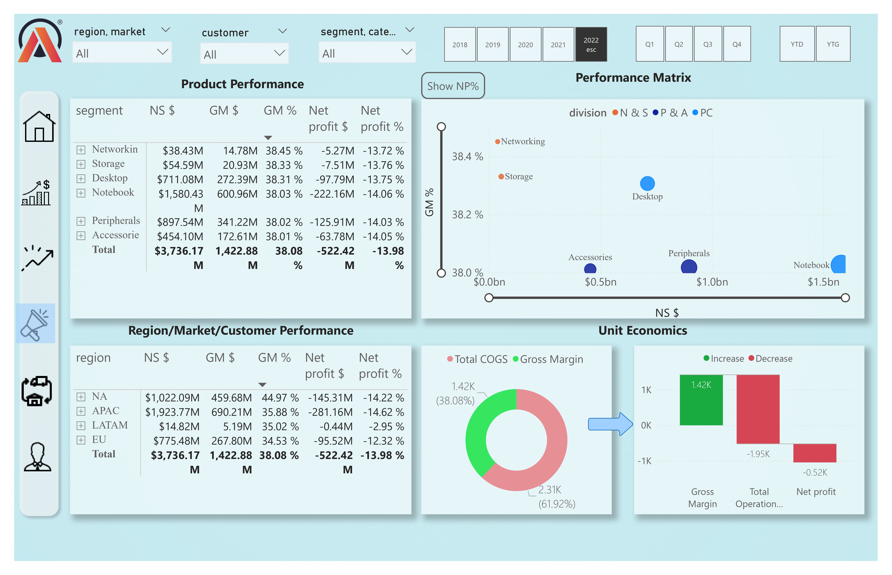
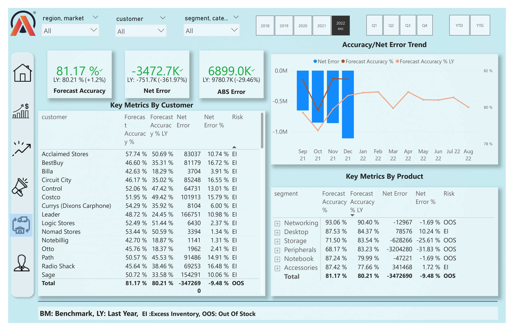
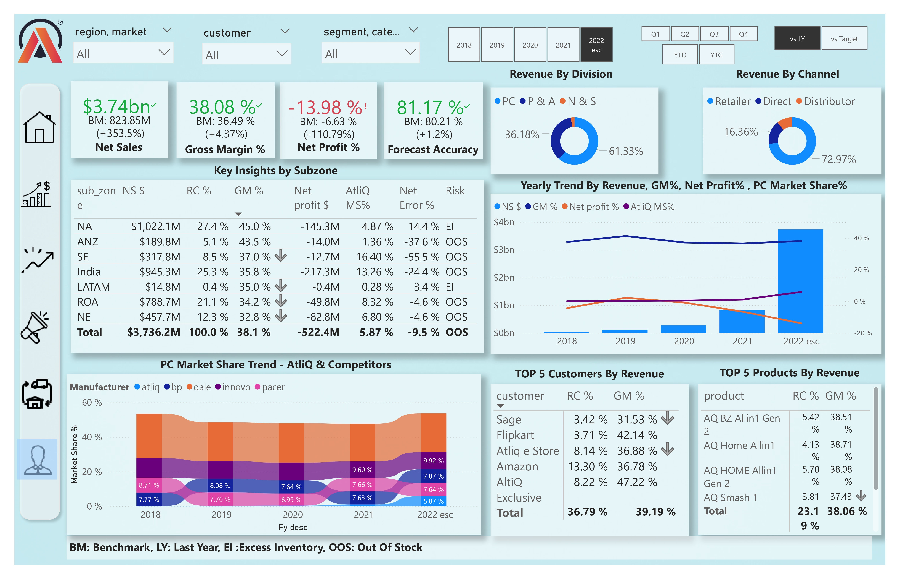

# Business-Insights-360

# Objective

AtliQ Hardware decided to implement data analytics in Power BI for the first time, enabling stakeholders across finance, sales, marketing, and supply chain to make data-driven decisions and stay ahead of competitors.

# Tech stacks

- SQL
- PowerBi Desktop
- PowerBi Service
- Excel
- Power Query
- DAX language
- DAX studio (for optimizing the report)

# Process
  - Importing data into PowerBi - Need to import the datasets from the MySQL database to PowerBi by providing the Database access credentials
  - Data Cleaning & Preparation - Handled missing values and duplicates. Formatting columns
  - Data Modeling - Built a star schema between fact and dimension tables
  - Created Measures using DAX- Developed calculated measures and columns as per the requirement
  - Visualization & Dashboard - Designed interactive dashboards, added KPIs, charts, filters, and slicers for better user experience.
  - Interaction with Stakeholders - Discussion with stakeholders for suggestions and new extra features
  - Insights and Reporting - Provided insights for finance, sales, marketing, and supply chain teams.
 
# Techniques Learnt
- Interaction and discussion with stakeholders
- Creating calculated columns
- creating  measures using DAX language
- Data modeling
- Using Bookmarks to switch between two visuals
- Page navigation with buttons
- Creating a date table using M language
- Dynamic titles based on the applied filters
- Using KPI indicators
- Conditional formatting of the values in visuals using icons or background color
- Data validation techniques
- PowerBi services
- Publishing reports to PowerBi services
- Setting up a personal gateway to set up the auto refresh of data
- Collaboration, workspace, access permissions in PowerBi services
and more 😅

# Dashboard 

  # _Home page View_
      
  **Home page** for users to navigate different pages/views within the dashboard.
       The icons have the navigation for their respective views

 # _Finance View_
      
  **Finance View** provides a comprehensive overview of the company’s financial performance.

- KPI Cards: Net Sales, Gross Margin, Net Profit

- P&L Statement: Summarized profit and loss for quick review

- Performance Over Time: Trend analysis across months/years

- Top & Bottom Products: Best and worst performing products

- Top & Bottom Customers: High-value customers vs. low-performing ones

  # _Sales View_
      
  **Sales View** highlights customer and product performance to track revenue and profitability drivers.

- Customer Performance Matrix: Net Sales, Gross Margin, and Gross Margin % by customer

- Product Performance Matrix: Net Sales, Gross Margin, and Gross Margin % by product

- Region-wise Performance: Matrix chart to compare sales across different regions

- Unit Economics: Analysis of Gross Margin, Netsales and Deductions to evaluate profitability at a granular level

- Top & Bottom Customers: High-value customers vs. low-performing ones

 # _Marketing View_
      
  **Marketing View** provides insights into product, region, and customer performance, combining both tabular and graphical perspectives.

- Product Segment Performance in table and graphical view: Net Sales, Gross Margin, Gross Margin %, Net Profit, and Net Profit %

- Region/Market/Customer Performance: Net Sales, Gross Margin, Gross Margin %, Net Profit, and Net Profit % across different segments
- Region-wise Performance: Matrix chart to compare sales across different regions

- Unit Economics: Total COGS (Cost of Goods Sold) vs. Gross Margin & Total Operational Expenses vs. Gross Margin

 # _Supply_chain View_
      
  **Supply_chain View** focuses on demand forecasting accuracy and error tracking to improve planning efficiency.

- KPI Cards: Forecast Accuracy, Net Error, Absolute Error

- Customer-wise Analysis: Forecast Accuracy, Last Year’s Accuracy, Net Error, and Net Error % by customer

- Product-wise Analysis: Forecast Accuracy, Last Year’s Accuracy, Net Error, and Net Error % by product

- Trend Analysis: Accuracy and Net Error trend over months for the selected year

# _Executive View_
      
  **Executive View** provides a high-level summary of overall business performance for decision-makers.

- KPI Cards: Net Sales, Gross Margin %, Net Profit %, Forecast Accuracy

- Subzone Insights: Regional breakdown to identify performance variations

- Market Share Trend: Track changes in market position over years

- Revenue Analysis: Revenue by Division and Revenue by Channel

- Top Performers: Top 5 Products and Top 5 Customers by revenue

- Yearly Trend: Revenue, Net Profit, Gross Margin %, and Market Share over years

# Project Outcome

By implementing data analytics with Power BI, AtliQ Hardware gained a 360° view of its business across Finance, Sales, Marketing, and Supply Chain. The project enabled stakeholders to make data-driven decisions and improve business performance in the following ways:

**Finance View**: Delivered clear visibility into Profit & Loss (P&L), key KPIs (Net Sales, Gross Margin, Net Profit), and top/bottom performers, helping the finance team track profitability drivers.

**Sales View**: Uncovered customer and product performance trends, regional sales variations, and unit economics (Gross Margin & Discounts), guiding pricing and sales strategies.

**Marketing View**: Provided insights into product segments, markets, and customers by Net Sales, Gross Margin, and Net Profit %, along with unit economics on COGS and operational expenses, supporting marketing campaign effectiveness.

**Supply Chain View**: Improved demand forecasting accuracy by analyzing Forecast Accuracy, Net Error, and Absolute Error at customer and product levels, ensuring better inventory and planning decisions.

**Executive View**: Gave leadership a consolidated view with key KPIs, market share trends, revenue breakdowns (by division and channel), and top 5 products/customers, enabling strategic decision-making.
    
    

